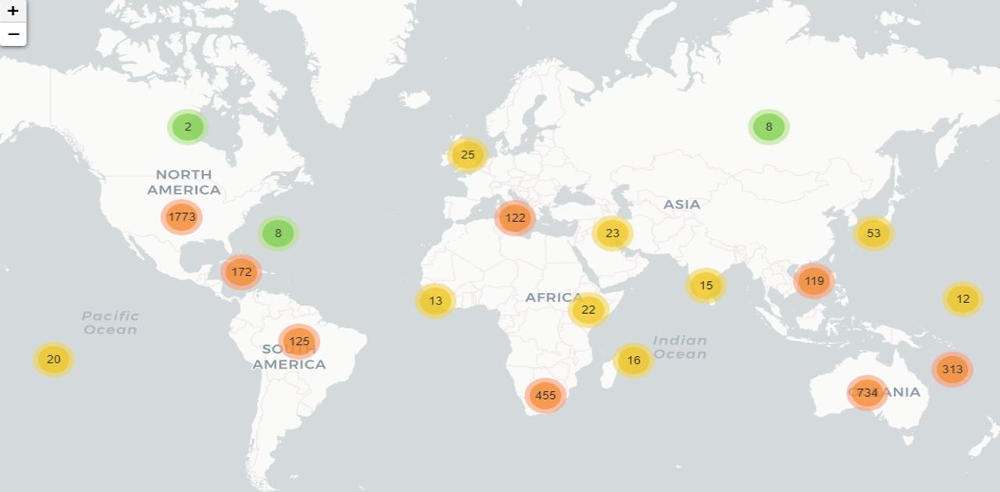

# W1 Project - Data cleaning & wrangling

## 1. Project Overview
This first project has been done through the collaborative efforts of Paula Hernández (GitHub repo: https://github.com/paulahdx) and Yu Ting (GitHub repo: https://github.com/yutinghuwu).

In this Project we have used Python3 to deal with a messy data set, and analyze and process it into valuable data, from which we have been able to extract valuable insights and information.

The data set was extracted from Global Shark Attack File. It consists of current and historical data of shark/human interactions, with the aim of better understanding these interactions, and minimize the risk of being injured by a shark, while contributing in the conservation of shark species worldwide. 

Data source: 
https://www.kaggle.com/datasets/teajay/global-shark-attacks?resource=download

## 2. Data import
Within Jupyter, we started by importing all requires libraries, followed by opening the Data Set (file 'attacks.csv') by using Pandas.

Once Data Set was imported, we made a general Data Set exploration, by use of df.head(), df.describe(),..., in addition to an exploration by columns using some EDA techniques to plot and analyze some of the columns that we considered most relevant for our analysis. 

This exploration allowed us to have a general overview of the data's distribution, being able to filter the scope in which we decided to focus our analysis.

## 3. Cleaning & Formatting the Data

### 3.1 Hypotheses
After examining the data in the previous section we decided to clean the data based on the following criteria:
- Keep the columns that will be relevant to our study (Case Number, Year, Type, Country, Activity, Sex, Age, Fatal(Y/N), Species).
- Focus the analysis on the data registered after 1950.
- Eliminate registers with empty/ not valid data.
- After cleaning the data according to the above criteria, we will:
    - Describe each variable
    - Analyze which factors may contribute to the fatility rate of shark attacks
    - Analyze the information by country

### 3.2 Selecting Columns and Eliminating Registers
Following steps were taken to clean the data:
- df.drop() to drop the columns that are not relevant to our study
- df.dropna() to eliminate registers containing all null values
- Filter by Year to eliminate registers from before 1950
- Eliminate registers that are not considered attacks (named as 'Invalid')

The resulting data frame has a total of 4120 registers and 9 columns.
 
### 3.3 Formatting Columns
In order to interpretate and analyze the data correctly, we needed to format the data to have standardized type of data and meaning.

Some of the cleaning techniques and methods used are: 
Drop columns, drop null values, string manipulation, dropna, isnull, map, 
filter, rename, replace, regex, lambda, datetime, append, etc.

In addition, we included new columns: 
- Country Code (Alpha-2 code per ISO 3166), by using pycountry
- Coordinates (Latitude and Longitude)
- Month
- Season in each geographical area

The final data frame has a total of 4050 registers and 14 columns.

All functions used to format columns have been included in a separate file src.py, which is then imported into main notebook analysis.ipynb file.

## 4. Data Visualization
Once all Data Set is cleaned and formatted, we used matplotlib and seaborn to plot our variables in univariate and bivariate graphs, in order to extract meaningful insights about the data and to present it in a visual manner.

### 4.1 Univariate Graphs 
- Total number of Attacks by Activity
- Percentage Attacks by Activity
- Attacks by Age Histogram
- Attacks by Shark
- Top 5 attacks by shark species 
- Total number of Attacks by Season
- Percentage Attacks by Season
- Total attacks by Sex

### 4.2 Bivariate Graphs 
- Percentage Fatality for all Shark Species
- Percentage Fatality for all Shark Species
- Percentage Fatality for Shark Species that caused fatalities
- Percentage of Fatality per Activity 
- Percentage Fatality per Season
- Fatality by Sex

### 4.3 Geographical Map 
As last, we used Folium and MarkerCluster to create a geographical world map to plot in an interactive way the total number of attacks per country. 

## 5. Conclusions
After all the the above, we have been able to extract following conclusions:
- Surfing is the sport with the highest number of registered shark attacks (33.2%)
- Despite this, Surfing is in the 7th out of 8 positions of activities that cause fatality.
- Top 3 activities that cause fatalities are: sea disaster, swimming and snorkeling (activities where people do not take additional equipment).
- Following Sea Disaster, unprovoked events are the most common type of event that causes fatality.
- 40% of attacks occur to people between 15 and 25 years old.
- 63% of attacks occur to people between 10 and 30 years old.
- The majority (86.7%) of attacks occur in people of male gender. However, although most attacks are registered in male gender, the % fatality is almost identical for both men and women.
- Only 15% of all shark attacks have been registered to cause fatality.
- The shark species with highest number of attacks is the White shark
- The most dangerous sharks, who attacked the most are: White shark, tiger shark, bull shark, nurse shark, bronze whaler shark. Except nurse shark, all of them caused fatalities.
- 40.2% of the attacks occur in the summer season, followed by 27.2% in the spring season.
- The top 3 countries with most registered shark attacks are: USA, Australia, South Africa.

## 6. Data export
To finalize our project, we exported the clean Dataset into a new csv file named 'attacks_clean.csv'.
